# Memory Systems and Processing-In-Memory

## Introduction: Why Are We Talking About Memory?

**Continued from previous articles**

- [High Performance Media Processing Distributed Data Flow: Zero-Copy And Kernel Bypass](https://github.com/BrianXu0623/article_media_processing_distributed_data_flow)


The first article focused on memory efficiency issues in media streaming processing data flow: optimizing data layout in memory through Cap'n Proto to eliminate serialization overhead, combining shared memory to eliminate inter-process data copying, and exploring the possibility of leveraging RDMA to bypass the kernel protocol stack and achieve zero-copy network transmission in distributed operator scenarios. These three respectively correspond to optimizations at three levels: **encoding latency, copy latency, and transmission latency**.

- [Serverless GPU Inference: Dev Guide & Next-Gen CXL-Based Architecture](https://github.com/BrianXu0623/article_next_gen_inference_arch)

The second article centered on large model inference operators: leveraging vLLM's asynchronous engine and dynamic batching mechanism, combined with single-task multi-concurrency capabilities, to optimize the low compute core utilization and memory wall problems encountered during inference. The latter half shifted toward the storage capacity bottleneck — in an era where model parameters easily reach 500–600 GB, offloading GPU/NPU video memory to CXL expansion memory through CXL disaggregated attached memory to resolve the inference batch size limitations caused by insufficient video memory; at the same time, discussing schemes to replace expensive HBM with multi-tier inexpensive CXL DDR memory, involving memory placement, promotion/demotion, and prefetch strategies.

The common thread of both articles is **memory** — whether it is data encoding and data movement efficiency, or storage capacity and bandwidth bottlenecks, the root of the problem points to the memory subsystem. This article will further deepen the perspective, starting from the physical principles of memory, to analyze why these bottlenecks exist and what fundamental solutions are available under the current architecture. The latter half of the article will focus on **Processing-In-Memory (PIM)** — an architectural design paradigm that directly embeds computation logic into the memory medium, aiming to fundamentally alleviate the latency and energy consumption caused by data movement.

### Memory Wall

Over the past 20 years, processor compute power (FLOPs) has grown at a rate approaching 60% per year, while DRAM bandwidth and latency improvements have long stagnated — latency decreases by only about 1.1% per year, and bandwidth improvements also fall far short of keeping up with compute power. Due to the nature of their hardware layout, processors are inherently easier to improve in bandwidth and frequency than memory — processors have large circuit board area, high manufacturing cost, and excellent fabrication quality, making it easier to insert more compute cores and increase frequency, while improving memory storage density and frequency is very difficult. The gap between the two is approximately **1 million times**, and this ever-widening scissors gap is the famous **Memory Wall**.

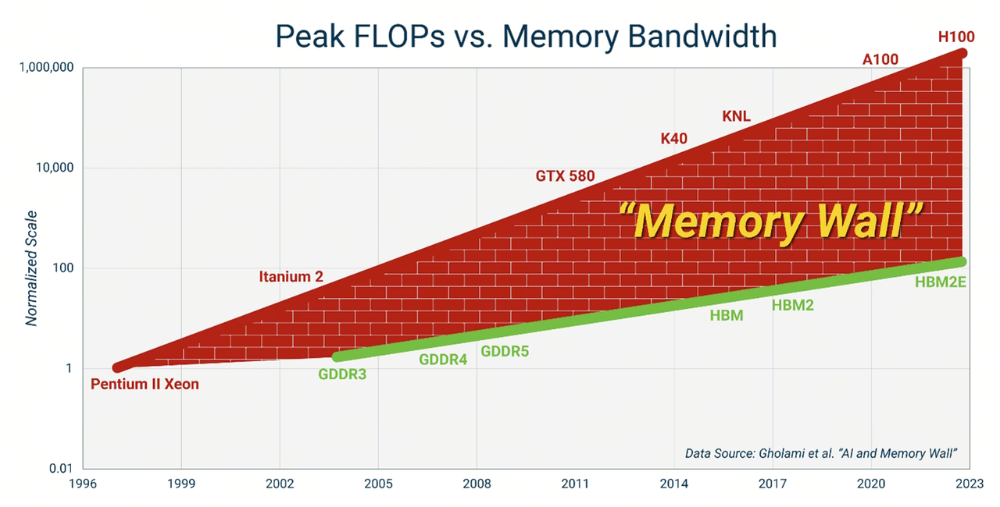

A concrete example: when doing large model inference, one often finds that compute core utilization is insufficient — this is usually a bottleneck caused by memory bandwidth. The bandwidth for transferring model parameters and KV cache data from memory to processor caches cannot keep up with the aggregate bandwidth of all compute cores, causing many cores to idle. Modern accelerators such as GPUs have a large number of compute cores, and consumers pay high prices for these compute cores that are not fully utilized, resulting in waste.

So in fact, for many model inference scenarios, especially those with high real-time requirements and relatively small batch sizes, mainstream modern GPU/NPU and other AI accelerators are not necessarily the best solution. Large model inference is just one scenario where memory bandwidth is the bottleneck — there are many other scenarios such as databases/caches/data lakes that actually have similar problems.

In the LLM era, the problem is further amplified: LLM inference is a typical **memory-bound** task, with arithmetic intensity (FLOPs / Byte) usually very low; the inference bottleneck is typically not in compute power but in the read bandwidth of KV cache and model parameters; the energy consumption of data movement is far higher than computation itself — a single DRAM access consumes approximately **more than 200 times** the energy of a single double-precision floating-point operation.

For this reason, **Processing-In-Memory (PIM)** and **Near-Memory Computing** have been re-recognized by both industry and academia as key paths to breaking through the Memory Wall.

The purpose of this article is to dissect the memory wall problem: first introducing some common forms and principles of memory, then analyzing why the memory wall problem exists, and finally introducing some novel research directions to address this problem.

---

## 1. Computer Architecture Overview: Processor, Cache, Memory

The classic von Neumann architecture consists of four parts: **controller, arithmetic unit, memory, and input/output**. One can see that the entire architecture is centered around the central processor — this design philosophy was reasonable in the era when processor and memory bandwidth were comparable. Today we will focus only on the first three, and specifically on the storage hierarchy on the CPU side.

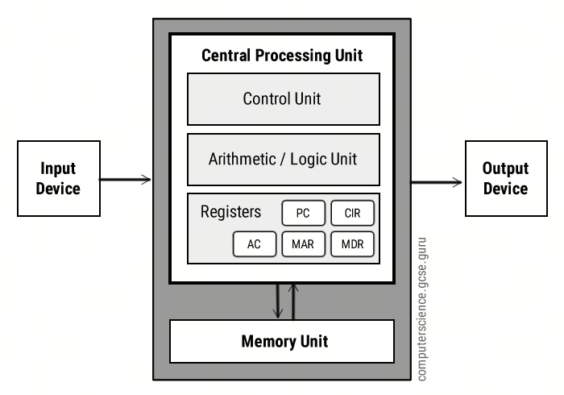

### 1.1 Processor (CPU)

Taking the modern CPU processor as an example, it internally contains various compute cores — ALU (Arithmetic Logic Unit), FPU (Floating-Point Unit), SIMD units (AVX-512, SVE, etc.), as well as a large number of registers (general-purpose registers, vector registers, with access latency of ~0 cycles) used to store intermediate results produced by these cores. The whole is driven by programs to form a pipeline (fetch, decode, issue, execute, memory access, write-back). Modern CPUs also include various complex techniques to improve bandwidth and parallelism: out-of-order execution implemented through ROB and reservation stations, branch predictors, speculative execution, runahead, prefetch, etc. — the core purpose of all of these is to hide memory access latency.

### 1.2 Cache

The purpose of cache is to alleviate the speed disparity between CPU and main memory. There is a layer of cache between CPU and memory. Modern CPUs typically include three levels of cache L1/L2/L3, constructed from finely crafted and expensive **SRAM** media. SRAM is characterized by large storage cell area, low density, high cost, and small capacity.

| **Level** | **Capacity** | **Latency (cycles)** | **Medium** | **Notes** |
| --- | --- | --- | --- | --- |
| L1D / L1I | 32–64 KB | 4–5 | SRAM | Per-core private |
| L2 | 256 KB – 2 MB | 10–15 | SRAM | Per-core private |
| L3 (LLC) | Tens of MB | 30–60 | SRAM | Shared by all cores |
| DRAM | GB-scale | 200–400 | DRAM | Main memory |

Each level of cache has somewhat higher capacity and latency than the previous level, where L1 and L2 are private to each CPU core, and L3 is shared by all CPU cores. In NUMA multi-socket architectures, each socket has its own L3 cache, and consistency issues between different sockets are handled through snoop filters and the MESI mechanism. Caches are only on the order of tens of KB to tens of MB in size.

Core mechanisms:

- **Cache line**: Typically **64 bytes**, the minimum unit of CPU cache access. The cache line is aligned with the single burst read/write granularity of memory (Section 5 will explain in detail why it is 64 bytes). This means that even if the CPU only reads 1 byte from memory, it needs to read an entire cache line from memory at once.

- **Multi-level cache coherence protocols**: MESI / MOESI / MESIF

- **Replacement policies**: LRU, PLRU, RRIP

- **Hardware prefetchers**: stride, stream, IP-based, etc., which analyze the CPU's memory access patterns to perform memory prefetch, thereby improving cache hit rates.

If data is to be synchronized from memory to the processor, it needs to travel all the way from memory to the memory controller, then to L3 cache, then to L2 cache, then to L1 cache, and finally to registers for the compute cores to read. This data path is very long, and the energy consumption is also very high — **a single DRAM access consumes more than 200 times the energy of a single double-precision floating-point operation**.

### 1.3 Main Memory and Memory Controller

Memory is composed of **DRAM** media, characterized by high storage density, large capacity, and low cost, but with higher latency than SRAM, and requiring continuous charge refresh to maintain data. Its energy consumption is also higher than SRAM, with capacity typically ranging from tens to hundreds of GB.

The processor and memory need to be connected through a **Memory Controller (IMC)**. Because the processor only cares about addresses, but memory actually has no concept of addresses — it has its own separate storage logic. The role of the memory controller is to map between these two sets of logic — mapping the processor's addresses into access commands that the memory can understand. Modern CPUs have already integrated the IMC into the die (since Intel Nehalem), connecting to external memory modules through DDR channels.

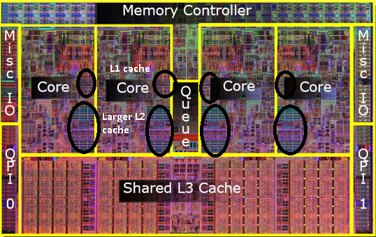

---

## 2. Overview of Mainstream Memory Types

In a broad sense, "memory" covers the entire memory/storage hierarchy from volatile DRAM to non-volatile NAND Flash. A quick overview:

### 2.1 DDR / LPDDR

The most classic and most common form of main memory in servers, this is **volatile memory** — requiring continuous charge refresh to maintain data, lost upon power loss. Each cell consists of **1 transistor + 1 capacitor (1T1C)**. Common variants:

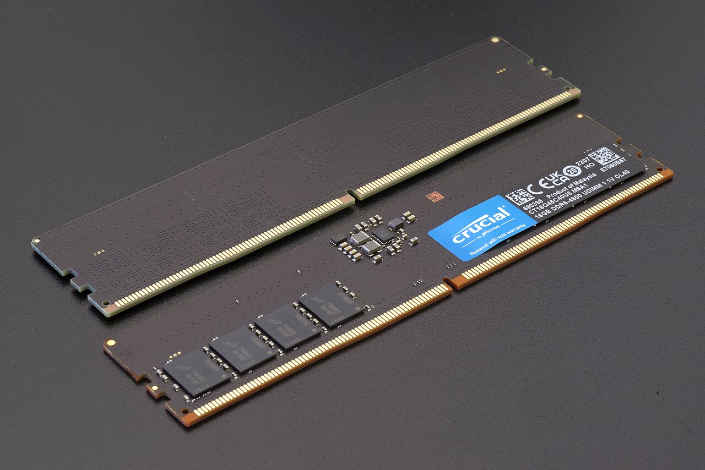

- **DDR4 / DDR5**: Server and desktop main memory. DDR5 single-module bandwidth can reach ~50 GB/s.

- **LPDDR4X / LPDDR5**: Low-power versions, mainstream in mobile devices and laptops.

### 2.2 NAND Flash

**Non-volatile memory** that does not require charging to maintain data and can persist. Flash memory has much higher latency and access granularity than traditional memory (reads by page 4–16 KB, erases by block of several MB, with latency at the μs level), and also has larger capacity.

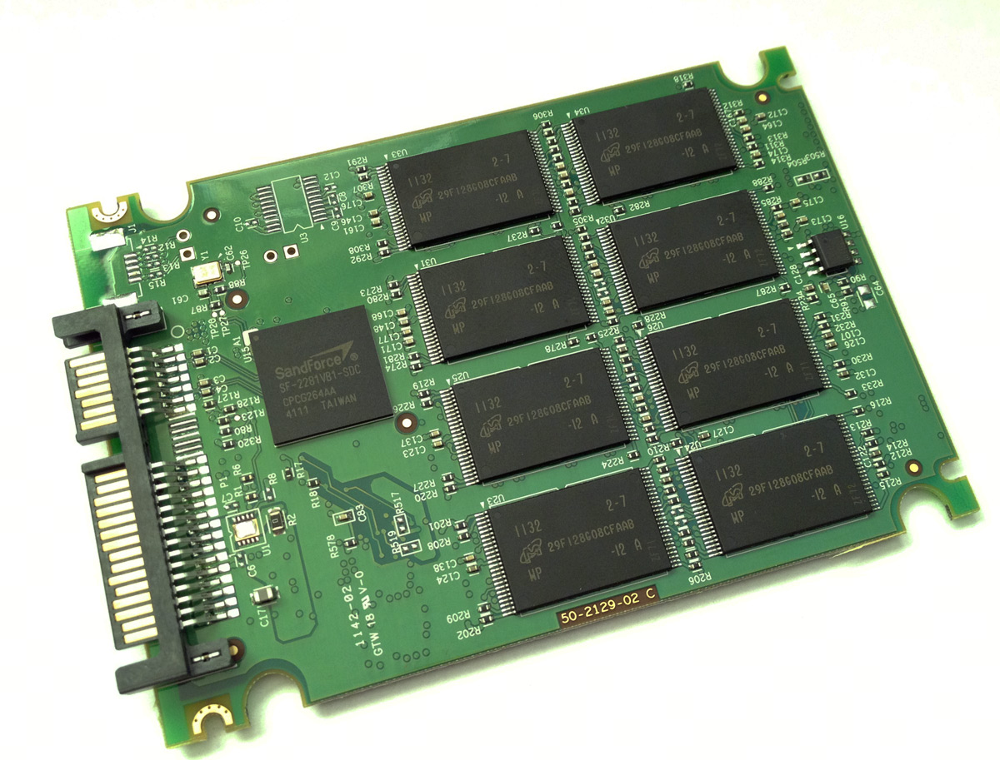

### 2.3 Optane / 3D XPoint

**Persistent Memory** jointly developed by Intel and Micron, positioned between flash and conventional memory — with latency approximately 5–10 times that of DRAM, but with large capacity, byte-addressable, and data not lost on power loss. When Optane first came out, many studies proposed using it to replace hard drives, but its applicability turned out to be poor, and it has been discontinued.

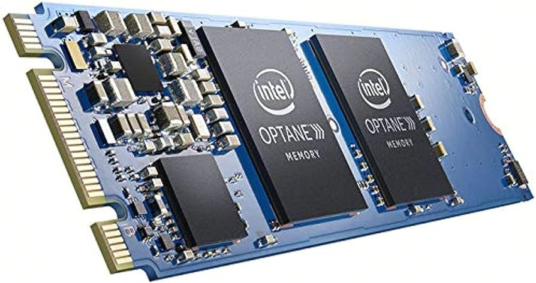

### 2.4 HBM (High Bandwidth Memory)

Currently the highest bandwidth memory, also called High Bandwidth Memory. Typically equipped on high-end AI accelerators such as H100, B200, and MI300.

HBM uses **3D TSV (Through-Silicon Via) stacking** of DRAM dies, combined with a **silicon interposer** (2.5D packaging) co-packaged with GPU/ASIC. Traces are only a few millimeters long, with no socket, micro-bump pitch at the micrometer level, allowing thousands of signal lines to be routed simultaneously. Therefore, HBM follows a **"wide and stable"** approach — using extremely wide buses and a large number of memory chips, achieving extremely high bandwidth without requiring very high frequency. The bus width per stack reaches **1024 bits**, and a single HBM3E stack can achieve bandwidth exceeding 1.2 TB/s. The fabrication requirements are the highest, and the cost is also the most expensive.

Specifically, the H100 SXM is equipped with 80 GB HBM3 with a total bandwidth of **3.35 TB/s**; the B200 is equipped with 192 GB HBM3e with a total bandwidth of up to **8 TB/s**.

The trade-offs are also obvious: HBM must be soldered together with the main chip and cannot be upgraded; stacking reduces the heat dissipation area, and cells are sensitive to temperature; capacity is limited by stack height and the number of dies — compared to DDR5 RDIMM modules that can reach 256 GB per stick, a single HBM stack is only on the order of 24–48 GB.

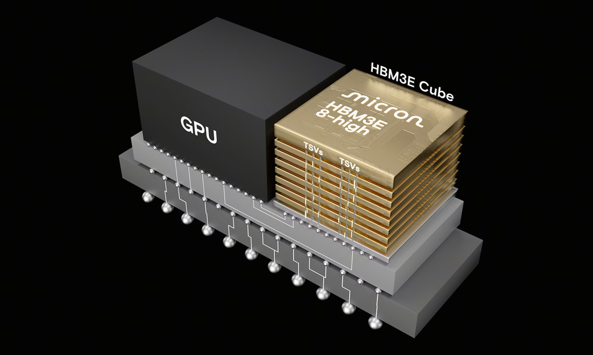

### 2.5 GDDR (Graphics DDR)

The mainstream medium for GPU video memory, primarily equipped on consumer and gaming graphics cards, such as RTX 4090/5090. GDDR takes a different route: **no stacking, directly pushing I/O frequency higher**.

- GDDR6X uses **PAM4** signaling, up to 21–24 Gbps per pin;

- Single chip 32-bit interface, data rate ~96 GB/s;

- A ring of GDDR chips is soldered onto the GPU PCB (typically 8–24 chips), providing a combined bandwidth of several hundred GB/s to ~1 TB/s.

The benefit of this approach is good heat dissipation and low voltage interference, making it easy to push to very high frequencies. However, the throughput gap with HBM is significant — taking the RTX 4090 as an example, 24 GB GDDR6X with a 384-bit bus provides bandwidth of approximately **1 TB/s**; while the HBM3 bandwidth of the H100 SXM is **3.35 TB/s**, and the B200 HBM3e reaches **8 TB/s**, a gap of 3–8 times. Additionally, the flat chip layout occupies a lot of PCB area, limiting video memory capacity (RTX 4090 has 24 GB, RTX 5090 has 32 GB).

GDDR has no DIMM layer — **chips are soldered directly onto the PCB**, connected to the GPU via traces. This means users cannot upgrade video memory, but latency is lower and routing is more compact.

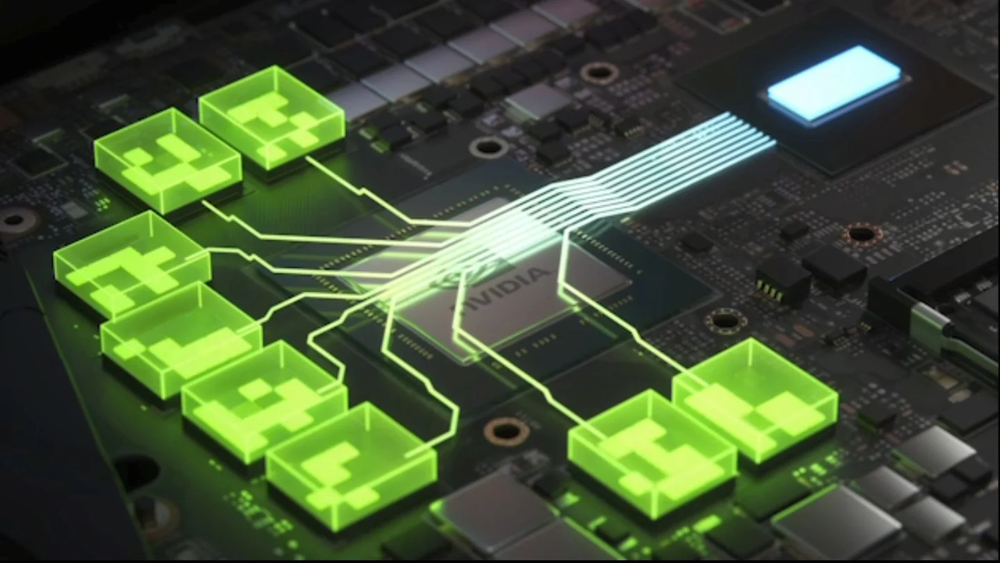

---

## 3. DRAM Fundamentals: Starting from the Capacitor

### 3.1 1T1C: The Smallest Unit of DRAM

At the most microscopic level, memory consists of a large number of **cells**, each storing a single bit. A cell consists of the following components:

- **Capacitor**: Stores the actual bit data. A charged state represents bit = 1, a discharged state represents bit = 0.

- **Transistor**: A switch controlling whether the cell is connected to the bitline.

- **Wordline**: The control signal that switches an entire row of transistors.

- **Bitline**: Connects all cells in the same column to the sense amplifier.

Because capacitors leak charge, periodic **refresh** is required (typically once every 64 ms).

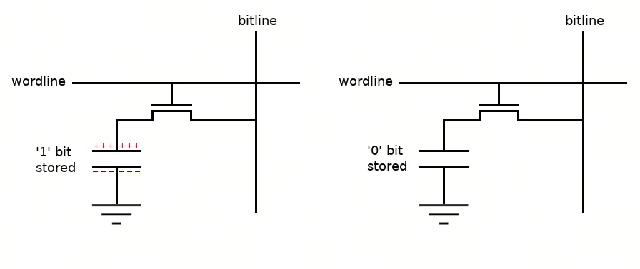

### 3.2 Read Process

To read the state of a capacitor:

- **PRECHARGE**: Precharge the bitline to Vdd/2 (half the standard voltage), and wait for the voltage to stabilize.

- **ACTIVATE (row open)**: Raise the corresponding wordline, turning on the transistors in the wordline, allowing the cell capacitor to share charge with the bitline. At this point, if the voltage in the capacitor is higher than Vdd/2, the bitline voltage will be slightly higher (by tens of mV); otherwise, it will be slightly lower.

- **Sense Amplifier amplification**: The **sense amplifier (SA)** below the bitline amplifies this weak voltage difference to full swing 0/Vdd, thereby reading the bit in the capacitor.

- **READ / WRITE**: Select the corresponding column through the column decoder and transfer the data to I/O.

- **PRECHARGE (row close)**: Precharge again, preparing for the next access.

**Note: ACTIVATE is a destructive read** — the cell capacitor will be drained, so the SA also serves the role of "**write-back**", writing the data back to the cell after reading.

### 3.3 Array Structure: Mat

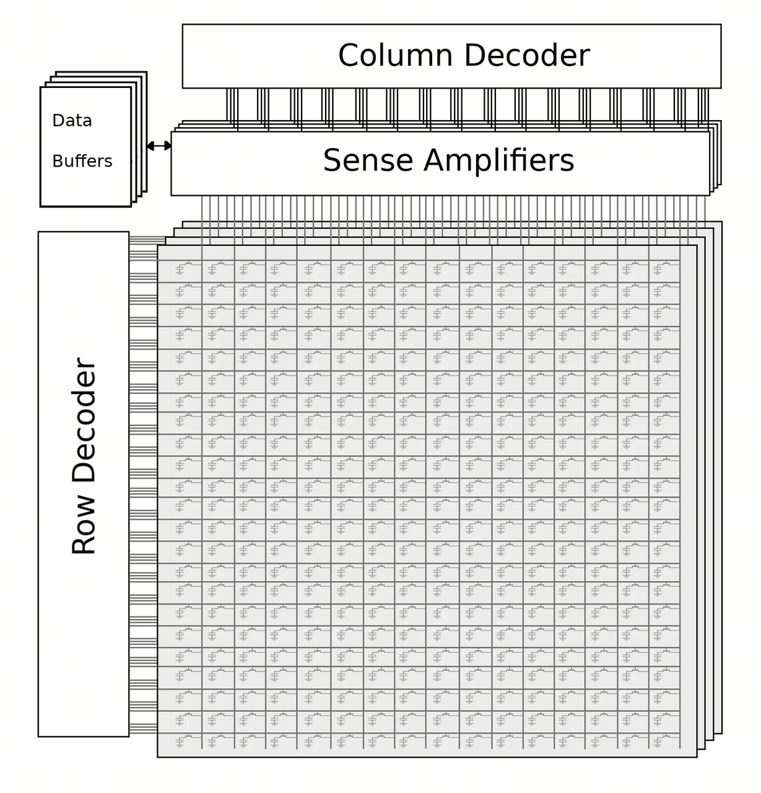

This diagram provides a more macroscopic perspective. A **Mat** typically consists of 512 × 512 cells, where each row is a wordline, each column is a bitline, and the bottom contains sense amplifiers.

The process of reading data from memory: first precharge all bitlines in the Mat to Vdd/2, then open all transistors in a row so that all capacitors in the row are connected to the bitlines, the sense amplifiers amplify the voltage, reading an entire row of bits. Then the column decoder synchronizes the required column data to the data buffer, and the I/O driver delivers it to the bus for transmission to the processor.

**Precharging and opening an entire row are very time-consuming** — ACTIVATE requires tRCD ≈ 14 ns, plus precharging takes approximately 22 ns in total, because it needs to wait for the voltage to stabilize. However, after opening a row, the SA retains the entire row's data (typically 8 KB), and subsequent reads of different columns within the already-opened row are very fast, with each column requiring only a single CAS command.

Therefore, memory prefers sequential accesses to data within the same row, rather than random accesses to different rows. This is what is known as **Row buffer hit / miss / conflict** — consecutive accesses to the same row are nearly free (hit), while accessing a different row requires PRECHARGE + ACTIVATE, more than doubling the overhead. This is why memory controllers perform **bank-level scheduling**, taking this into account when designing address mappings.

---

## 4. DRAM Hierarchy: From CPU Die to Mat

DRAM is not a flat byte array, but a highly layered hardware structure. The memory structure is very complex, with many levels, each level having its own independent parallelism logic:

```
CPU Die
 └── Memory Controller (IMC)
       └── Channel        (independent bus, fully parallel)
             └── DIMM     (physical module on the slot)
                   └── Rank   (a group of chips sharing data lines, typically one Rank per side)
                         └── Chip / Device
                               └── Bank Group (sharing GIO)
                                     └── Bank      (smallest unit of parallelism)
                                           └── Subarray
                                                 └── Mat
                                                       └── Cell array (1T1C)
```

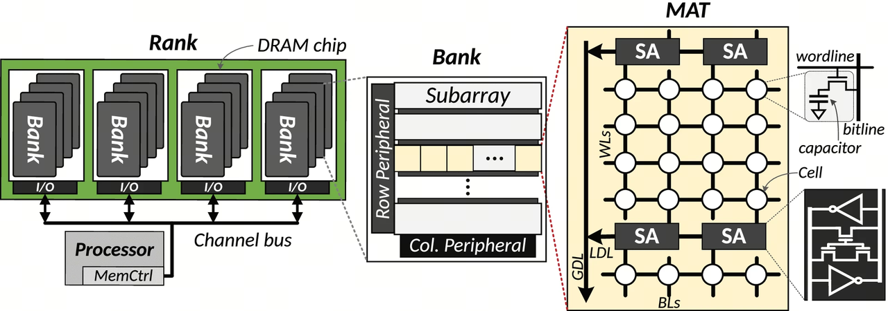

### 4.1 Granularity and Parallelism at Each Level

- **Channel**: A completely independent DDR bus. A memory controller typically has multiple Channels, with each Channel typically connecting one memory module. Different Channels connect to different memory module devices and can operate completely independently in parallel. Multiple channels provide linear bandwidth improvement. This is **Channel-level parallelism**. Server platforms commonly have 8-channel DDR5.

- **DIMM**: A single module, which can have 1–2 ranks.

- **Rank**: A group of chips sharing a chip select, where **all chips in the same rank respond simultaneously**, piecing together a 64-bit data word. A memory module typically has two sides, each side being a Rank. Ranks can work completely independently in parallel (pipelined), and the memory controller alternates access between two Ranks to improve parallelism. This is **Rank-level parallelism**.

- **Chip (Device)**: A single DRAM IC, with an external interface width of ×4 / ×8 / ×16 bits (DDR5 commonly uses ×4, ×8). Multiple chips within a Rank are connected in parallel to make up the channel width — for example, 8 ×8 chips make up 64 bits. Each chip works in parallel, receiving identical commands, reading identical addresses, and then outputting their local data to the processor in parallel. So if the processor wants to read a 64-byte cache line, this data is actually distributed across the same location in multiple chips, with each chip storing a portion, and all reading out in parallel together for delivery to the processor. This is **chip-level parallelism**.

- **Bank Group (BG)**: Introduced in DDR4 and further expanded in DDR5. Within a chip, data paths between different BGs are independent, but banks within a BG share the **GIO (Global I/O)**. DDR5 typically has 8 BG × 4 banks = 32 banks/chip.

- **Bank**: The **smallest independently parallel unit** in DRAM. Each bank has its own row buffer and can independently open different rows. Each bank can be independently precharged, activated, and read. Banks have internal **LIO (Local I/O)** to transfer column data from the SA to the bank boundary. Different banks within the same Bank Group share the LIO.

- **Subarray**: A bank is internally divided horizontally into many Subarrays, each Subarray having an independent SA row. Subarray-level parallelism is the foundation of many PIM / RowClone / Ambit works.

- **Mat**: Each Subarray is further divided vertically into many Mats, with each Mat consisting of approximately 512 × 512 cells. Once a Subarray is selected, all Mats within it must be activated simultaneously. The reason for such fine partitioning is to keep the bitline and wordline lengths of each group of Mats shorter — if too long, it would reduce voltage stability and increase the difficulty of each precharge and activation.

### 4.2 Why Are Memory Frequency and Capacity Hard to Scale?

The capacitor-plus-transistor structure of memory is inherently unsuitable for horizontal scaling:

- The voltage in capacitors **leaks** to nearby transistors;

- Excessively high frequencies cause chip temperature to rise, further exacerbating voltage instability and leakage;

- Rows of cells that are too close to each other also **interfere** with each other, causing voltage instability.

However, processors have large circuit board area, high manufacturing costs, and excellent fabrication quality, making it easier to insert more compute cores and increase frequency. Therefore, the bandwidth gap between processors and memory keeps growing.

### 4.3 Memory-Level Parallelism (MLP & BLP)

So why are so many levels of parallelism needed? Memory frequency is far lower than processor frequency, and each precharge and opening of a new row is very slow. If only one bank is responding to processor commands at any given time, the processor would spend most of its time idle waiting for data transfer.

Therefore, all these levels of parallelism are essentially designed to maximize **interleaving** between different banks — alternately responding to commands from the processor. As soon as one bank finishes outputting data, the next bank immediately takes over, and the previous bank can continue precharging and opening a new row.

**Key insight**: **ACTIVATE / PRECHARGE / CAS are all bank-local operations, and any banks can perform them in parallel** — internal command pipelining can have dozens of banks simultaneously in different stages (A in ACTIVATE, B waiting for data, C in PRECHARGE). **The only serialization point is the DQ output**: a chip only has one set of DQ pins externally, so only one bank can be outputting data at any given moment. However, the cross-BG switching tCCD_S = 4 cycles is exactly equal to the duration of one BL8 burst, so the DQ can seamlessly switch from one bank to the next with zero idle time.

This is **memory-level parallelism**, also called MLP / BLP — these two terms are often used interchangeably:

- **MLP (Memory-Level Parallelism)**: A CPU-side metric — the number of outstanding (in-flight) long-latency memory requests at any given moment. Determined jointly by OoO execution, MSHR count, hardware prefetchers, runahead, etc.

- **BLP (Bank-Level Parallelism)**: A DRAM-side metric — the number of actively working banks at any given moment. Determined by bank count, address mapping, and scheduling algorithms.

Both must match to saturate bandwidth: insufficient CPU MLP → DRAM idles; insufficient DRAM BLP → CPU requests pile up.

### 4.4 Address Mapping

Address mapping is the most critical job of the memory controller. The mapping from physical address to (channel, rank, bank, row, column) needs to be carefully designed — a good mapping directly impacts the throughput a workload can achieve.

General mapping rules:

- **Map lower address bits to channel / rank / bank group**: Scatter consecutive addresses across different parallelism levels to maximize memory-level parallelism.

- **Map higher address bits to row index**: Ensure consecutive memory typically maps to the same row, reducing the number of times a bank needs to open different rows.

However, no single mapping rule can optimally satisfy different workloads, and the memory controllers in modern mainstream commercial processors (X86, ARM) are not programmable. But open-source ISAs like RISC-V can be used to customize address mapping logic, and FPGAs can also replace the memory controller to connect directly to the processor and DRAM, thereby customizing address mapping logic. Different CPU vendors have different strategies, and latency-sensitive workloads are strongly affected by the mapping. What address mapping is optimal for different workload patterns is also a very active research direction.

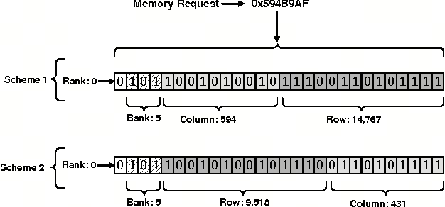

---

## 5. Prefetch and Burst: Why DDR Transfers Data "in Bursts"

### 5.1 Burst Length

DDR4's burst length is fixed at 8 (BL8). The relationship is very clean:

- DDR4 channel = 64-bit data width (typically 8 ×8 chips in parallel)

- BL8 × 64 bit = 512 bit = **64 bytes = 1 cache line**

A single burst transfers exactly one cache line, naturally aligned with the CPU's access granularity. That is, even if the CPU only wants to access 1 byte, the memory will return 64 bytes to the processor cache in one go.

**Why burst?** Two core reasons:

**(1) Amortize the row open cost**

ACTIVATing a row costs tRCD ≈ 14 ns, but the SA retains the entire row's data (typically 8 KB) as a result. When sequentially reading multiple columns within an already-opened row along the row buffer, **each column requires only a single CAS command**, with virtually no row overhead — this is row buffer locality. Burst is essentially packaging "one row open → multiple column reads" into a single command.

**(2) Match the internal-external frequency gap**

Taking DDR4 as an example, the DRAM cell array internally runs very slowly (~400 MHz), while the external data bus is 8 times faster (DDR4-3200 at an effective 3.2 GHz). A single column operation internally fetches 64 bits in one beat, but externally it takes 8 beats to send them out — **these 8 beats are BL8**. This is also a means to cope with the fact that memory's internal bandwidth is far lower than the external bus bandwidth, by outputting more data at once to improve memory throughput.

### 5.2 Internal Prefetch Architecture

Taking DDR4's "8n prefetch" as an example, for a ×8 chip, **a single column operation internally fetches 64 bits in parallel** (8 × 8 bits), then the serializer splits it into 8 beats, sending them out serially along 8 DQ pins:

```
cell array → SA → LIO → GIO
  one slow beat, 64 bits in parallel
                ↓
           serializer
                ↓
          DQ × 8 pins
     8 fast beats, 8 bits per beat
```

**One internal fetch = 8 external beats** — this is the essence of the prefetch architecture, and also one of the means by which DDR can double external bandwidth while the cell frequency has remained unchanged for years.

### 5.3 Difference from CPU Prefetcher

This prefetch and the processor's prefetch are prefetches in two different dimensions:

- **DDR burst / prefetch**: The DRAM controller's internal parallel access to the cell array, a byproduct of every READ command, invisible to software.

- **CPU hardware prefetcher**: A predictor built into L1/L2 that proactively issues additional cache line fills — a **speculative** behavior that may waste bandwidth.

---

## 6. HBM and GDDR: Underlying Differences in High-Bandwidth Video Memory

Up to this point, the fundamentals of memory have been covered, using CPU memory as the example. In fact, GPU and other high-end AI accelerator memory are based on the same principles — the underlying storage medium is volatile DRAM, just with different chip arrangement and combination methods.

### 6.1 HBM

The key innovation of HBM is **3D stacking + TSV (Through-Silicon Via)**:

- Multiple DRAM dies (typically 4–12 layers) vertically interconnected through TSV;

- The bottom is the **base die (logic die)**, responsible for interface conversion and (in HBM-PIM) computation;

- The entire stack is co-packaged with the GPU/ASIC through a **silicon interposer** (2.5D packaging);

- Bus width up to **1024 bits / stack**, with moderate operating frequency sufficient to achieve TB/s-level bandwidth.

Within each Cube, TSV through-hole technology connects the Channel data lines to the banks on each layer of chips. The entire Cube is vertically partitioned into many Channels — somewhat like an apartment building with many units, each unit having its own independent elevator. Different Channels operate independently in parallel, with each Channel typically having a 64-bit width — 16 Channels per Cube yields 1024 bits of total width. Compared to the 64-bit width of traditional memory modules, throughput increases many-fold.

A single HBM3E stack has already reached 1.2 TB/s, and with multiple stacks on the B200, total bandwidth of ~8 TB/s can be provided.

The trade-offs are also obvious: expensive (interposer process, TSV yield, packaging cost); vertical stacking leads to poor heat dissipation, and voltage interference between different chips means HBM frequency cannot be too high; capacity is limited — compared to DDR5 RDIMM modules at 256 GB per stick, a single HBM stack is only on the order of 24–48 GB. Moreover, HBM must be soldered together with the main chip and cannot be upgraded.

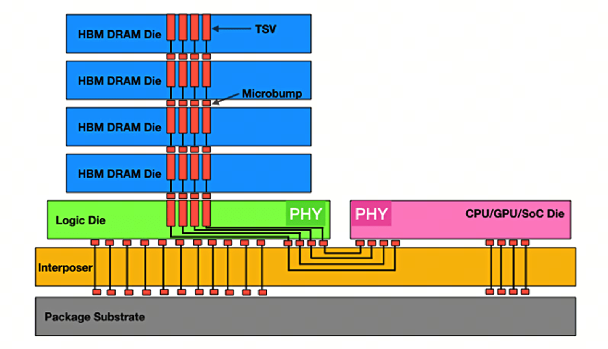

### 6.2 GDDR

GDDR takes a different route: **no stacking, directly pushing I/O frequency higher**.

- GDDR6X uses **PAM4** signaling, 21–24 Gbps per pin;

- Single chip 32-bit interface, data rate ~96 GB/s;

- A ring of GDDR chips is soldered onto the GPU PCB (typically 8–24 chips), providing a combined bandwidth of several hundred GB/s to ~1 TB/s.

Taking the RTX 4090 as an example: 24 GB GDDR6X, 384-bit bus, 21 Gbps/pin, total bandwidth of approximately **1 TB/s**. The RTX 5090 upgrades to 32 GB GDDR7, 512-bit bus, bandwidth of approximately **1.8 TB/s**.

Good heat dissipation and low voltage interference are GDDR's advantages, but the throughput gap with HBM remains large: the RTX 4090's ~1 TB/s versus the H100's 3.35 TB/s and the B200's 8 TB/s — a gap of approximately 3–8 times. Moreover, the flat chip layout occupies PCB area, and video memory capacity is limited.

GDDR has no DIMM layer — **chips are soldered directly onto the PCB**, connected to the GPU via traces. Users cannot upgrade video memory, but latency is lower and routing is more compact.

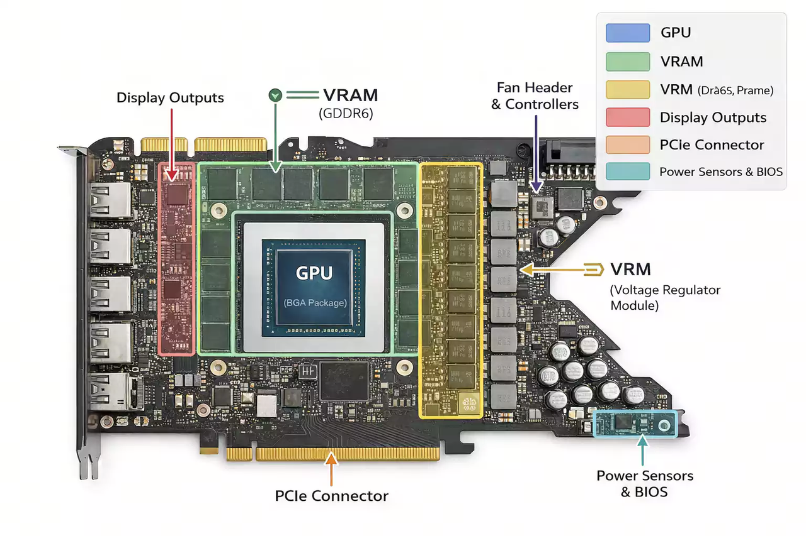

### 6.3 Differences in Address Mapping

An interesting point: to improve Channel-level parallelism, HBM scatters consecutive addresses across **different Channels on the same die layer**. To improve Channel-level parallelism, GDDR scatters consecutive addresses across **different chips**. This address translation is all the responsibility of the memory controller.

---

## 7. Reflection: Is the Processor-Centric Design Still Appropriate?

Up to this point, the basic concepts related to memory have been covered. One can observe that current memory, limited by bus width, can only have one bank truly outputting data at any given time within the same Channel, while other banks must wait in queue — the true bank-level parallel potential of memory has not been fully exploited.

Moreover, data traveling from memory to the processor must pass through: sense amplifier → data buffer → LIO → GIO → bus → memory controller → multi-level processor caches → registers. The data transfer path is complex and long, resulting in substantial energy consumption. While memory throughput improves year over year, it still falls far short of keeping up with the rate of processor bandwidth improvement.

Therefore, in modern computer architecture, **is reading data from memory and then transmitting it layer by layer to a distant central processor really the optimal design philosophy?** Is it appropriate that memory can only serve as a storage unit? Is the direction of continuously stacking buses, stacking frequencies, and pushing address mapping algorithms and various prefetch and runahead algorithms to their limits on the existing architecture the right approach?

Especially for **memory-bound, memory-access-dominated workload patterns** — such as the decoding stage in large model inference, where GEMV is the primary computation under small batch sizes, computational intensity is low, and memory data movement becomes the bottleneck.

---

## 8. Near-Memory Computing vs. Processing-In-Memory: Bringing Computation to Data

> "Cellular Logic-in-Memory Arrays" (1969) — William H. Kautz
>
> In 1969, Kautz first proposed placing computation directly within the storage units of memory, thereby avoiding the latency and energy consumption brought by the long data path.
>
> "Processing data near, and in, where data resides or is produced simply makes sense, from a very fundamental first-principles standpoint." — Onur Mutlu
>
> Onur Mutlu is the key figure who has championed and expanded this idea in recent times, proposing the philosophy that computer architecture should not default to being processor-centric but rather should be designed **with memory at the center**, and has driven a large volume of academic research and practical deployment in this field.

### 8.1 Concepts

- **Near-Memory Computing (NMC / PNM)**: Compute units are placed **near** but not embedded in the DRAM array — located on the base die, buffer chip, CXL controller, logic on the DIMM, etc.

- **Processing-In-Memory (PIM)**: Compute cores are **directly embedded** inside the DRAM bank, or even directly using the DRAM array itself for computation (PUM). Compute cores are placed right next to the sense amplifiers within the bank, allowing them to directly read data from the row buffer, and write results directly back to the row buffer after computation.

### 8.2 Forms of Near-Memory Computing

Arranged from farthest to nearest by PE distance from the cell array:

**(1) Memory Controller / CXL Controller Level NMC**

A Memory Controller or CXL Controller typically connects multiple memory modules. Compute or control cores can be added within the controller, typically used for data reduce across different memory modules and prefetch. The controller of CXL.mem devices (Type 2 / Type 3) is already managing remote memory access, making it a natural NMC location.

**ReCXL (ISCA 2024)** places NDP logic into the CXL controller, targeting the embedding access patterns of recommendation model training for prefetching and reduce — completing the entire embedding training workflow within CXL memory, with the host only issuing commands and not participating in the data flow.

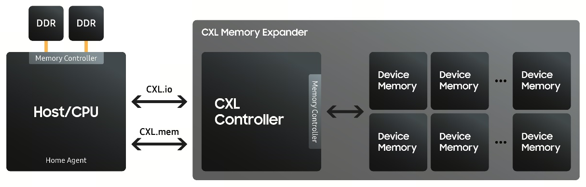

**(2) Rank-Level NMC (near-rank PIM)**

Integrating compute cores on each Rank of a memory module, typically used for reduce across different chips within a Rank. Parallelism is lower than bank-level and can be used for reduce of results across banks. Mainly academic proposals.

**(3) Logic Die Level NMC (HBM base die)**

The Logic Die is the bottommost chip in an HBM Cube, which itself does not store data, serving as a control chip (similar to a Memory Controller). Acceleration logic can be integrated on the Logic Die — only a few layers of TSV away from the cell array — to perform reduce across different dies or different Channels within an HBM Cube.

**Summary**: Near-memory computing primarily places compute cores and control cores near the memory modules, used for data reduce and prefetch across different memory modules, and can also serve as shared data buffers between different modules. It mainly saves the latency and energy of transferring data from the Memory Controller to each level of processor cache. However, due to the limited area and process technology of the controller itself, it is not well-suited for very complex or compute-intensive operations.

### 8.3 Processing-In-Memory (PIM): Bank-Level PE

The representative of PIM is the **bank-level PE** — integrating a lightweight compute unit next to each DRAM bank, directly reading that bank's row buffer.

The key to this type of design is that — **bank-level PEs directly utilize the bank's internal bandwidth**. As discussed in Section 4.3, DRAM's true bottleneck is the DQ: internal banks are highly parallel, but are forced to serialize at the DQ output. Bank-level PEs move computation before the DQ — data goes from the row buffer via LIO directly to the PE, **completely bypassing both the GIO and DQ serialization points**.

To put concrete numbers on this: a single DDR5 chip has 32 banks. If each bank has one PE working simultaneously, the total internal data throughput = 32 × internal bandwidth per bank, far exceeding the DQ output's few tens of GB/s.

**UPMEM**

The industry's first commercially available processing-in-memory product (2019). Based on standard DDR4 DIMM memory modules, UPMEM literature explicitly categorizes it as "near-bank DRAM-PIM".

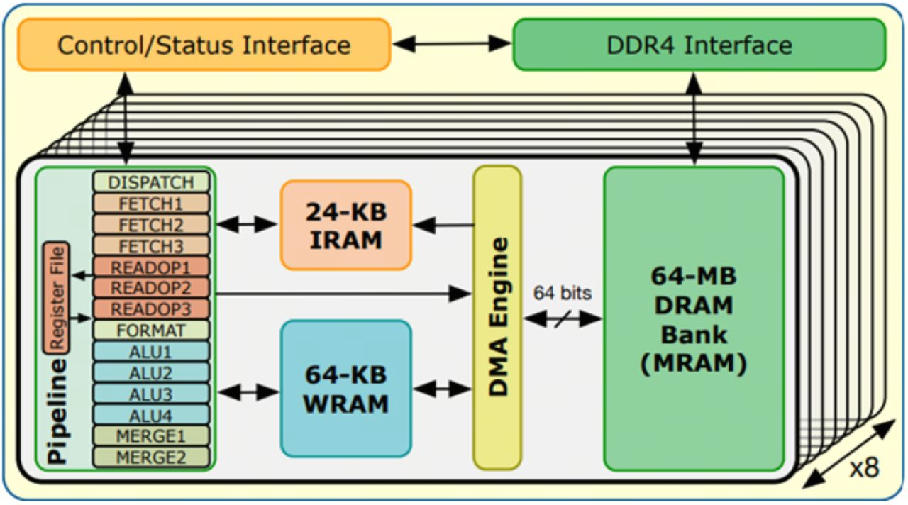

Each chip contains many banks, with each bank storing 64 MB of data. Integrated next to the row buffer of each bank are:

- **DPU**: A 32-bit RISC core, 400 MHz compute core

- **IRAM (Instruction SRAM)**: Instruction cache

- **WRAM (Working SRAM)**: Working cache / scratch pad, for staging intermediate results, can also serve as a look-up table

The instruction decoder in the bank listens to the command line connected to the Memory Controller and uses a **reserved flip bit** to determine whether the current mode is normal mode or PIM mode:

- Normal mode: Normal memory read mode through the column decoder and IO driver
- PIM mode: Decode the instruction and schedule the relevant PIM core to read data from the bank's row buffer for computation

So in traditional computer architecture, the central processor issues commands, reads data from memory to registers, and then executes computation commands. In the processing-in-memory philosophy, the central processor **sends commands to the memory**, and the compute units within the memory directly read data from the bank for computation. Data size is typically very large, while instruction size is typically very small, and the transmission cost and path complexity of instructions are far lower than those of the raw data itself.

In terms of specifications, 8 chips × 8 banks/chip = 64 DPUs/rank, for a total of 128 DPUs per DIMM (2 ranks). **Note: There is no direct communication path between DPUs — all cross-DPU coordination (including AllReduce) must go through the host CPU** — this is a common pain point of bank-level PIM, and also the reason why buffer-chip / rank-level NMC exists.

**Samsung HBM-PIM (Aquabolt-XL)**

Samsung released an HBM-based PIM device. A **PCU (Programmable Computing Unit)** is integrated next to each bank (or every two adjacent banks) of the HBM, supporting FP16 MAC, ReLU, and other basic operators. In their approach, only half of the dies become PIM dies, while the other half remain ordinary dies — because PIM compute units occupy DRAM chip area and incur additional power consumption, ordinary dies have greater storage capacity than PIM dies. This is a less aggressive approach.

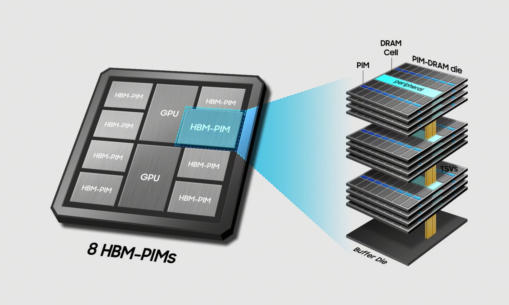

**SK Hynix AiM / GDDR6-AiM**

A GDDR6-based PIM device released by SK Hynix, with one PE per bank, optimized for GEMV. Performs computation on bank-local data.

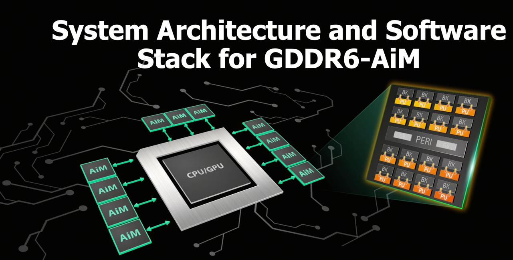

### 8.4 Data Layout Issues in PIM Scenarios

One may notice a problem: in traditional memory, to improve MLP / BLP, consecutive data is typically scattered across different channels, ranks, bank groups, and banks. However, in PIM, each compute unit can only see bank-local memory — if data is still scattered, local computation cannot be performed.

Therefore, in the processing-in-memory domain, data needs a **completely different layout** — the address mapping logic of the memory controller needs to be modified to place consecutive data that needs to be computed by PIM units **as much as possible within the same Bank**, thereby avoiding data synchronization across different banks or partial reduce of results.

This is also a very active research direction in the PIM field — **Software-Hardware Co-design**:

- How to define memory controller address mapping rules for different types of workload patterns
- How to perform memory placement
- How to determine which operators should be scheduled to which PIM device
- Which operators are suited for the central processor, which are suited for PIM compute units, and which are suited for PNM compute units
- How to design intelligent rules that are reasonably general across different workload patterns

**For example**: In large model inference, the prefill stage typically involves large amounts of GEMM with high computational density, which can be placed on the central processor; the decode stage typically involves GEMV with lower computational density, which can be placed on PIM devices. For models with large parameter counts, the tensors used by GEMV operators can be split and mapped across different banks, with each bank performing partial GEMV, and finally using PNM units or the central processor for partial reduce.

---

## 9. Benefits and Costs of Introducing Processing-In-Memory

### 9.1 Benefits

**(1) Truly Fully Utilizing Bank-Level Parallelism**

In traditional memory, a chip typically has dozens of banks that need to interleave and take turns outputting data to the bus — within the same chip, only one bank can output data at any given time. Processing-in-memory can truly fully utilize bank-level parallelism — the PE (processing entry) of each bank can operate completely in parallel and independently on bank-local data. One PE per bank means **hundreds of** truly parallel lanes — an internal parallelism that neither CPU SIMD nor GPU SIMT can directly achieve. This also avoids throughput issues caused by narrow per-chip bus widths, and avoids the latency and energy consumption issues of memory data having to traverse layer upon layer of links to reach the processor. LLM GEMV, KV cache scan, vector database similarity computation, and other scenarios are naturally suited.

**(2) Significantly Reducing Data Movement**

Data movement is the true energy consumption culprit. Some classic numbers (from Mark Horowitz's ISSCC keynote):

- 32-bit ADD: ~0.1 pJ
- 32-bit FP MUL: ~3.7 pJ
- 32 KB SRAM read: ~5 pJ
- DRAM read (off-chip): ~640 pJ

A DRAM access costs nearly **200 times** more than a single multiplication. Moving computation into the bank can achieve energy savings of **5–10 times or more**, which is highly significant for data center electricity costs, power density, and AI scaling laws.

**(3) Freeing External Bandwidth**

PIM digests memory-bound operators internally, so the host bus (DDR / CXL / NVLink) can be freed for truly compute-intensive operators (GEMM). In PIM architectures, typically only a lighter-weight central processor is needed, handling only truly compute-intensive operators, while delegating memory-bound operators to the PE in each bank.

### 9.2 Costs

**(1) Die Area and Storage Density**

PIM compute units occupy memory chip area, reducing chip storage density — PIM conversion is generally believed to cause **5%–15% capacity loss**. For hyperscale data centers, this represents real money.

**(2) Thermal and Reliability**

DRAM is extremely sensitive to temperature — higher temperatures require more frequent refresh (refresh intervals shorten with temperature) to maintain stable voltage in capacitors. Computation generates heat, and PIM causes DRAM to operate at higher temperatures, increasing refresh overhead and reliability risk. For HBM's 3D stacked structure, which already has poor heat dissipation, adding additional compute units within the cube further exacerbates the thermal problem.

**(3) Programming Model and Ecosystem**

PIM currently lacks a mature, general-purpose programming model and ecosystem, unlike GPUs which have CUDA. UPMEM, HBM-PIM, and AiM each have their own APIs. How to partition operators, how to synchronize between host and PIM, how to map data layout to banks — various frameworks/programming models and design philosophies are emerging one after another, and no industry standard has been established.

**(4) Not General-Purpose**

PIM cores are typically few in number and weak in compute power, only meaningful for memory-bound, low-arithmetic-intensity operators. For compute-bound operators like GEMM, they lose their advantage and can actually be a drag. Therefore, PIM will inevitably exist as a **coprocessor**, working in coordination with CPU/GPU, and currently still needs to be used in conjunction with a central processor.

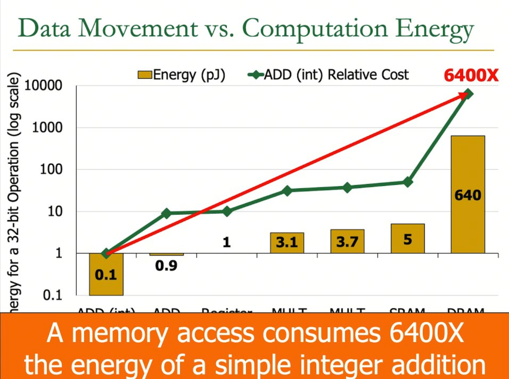

---

## 10. PUM: Processing Using Memory (Extended Topic)

In addition to near-memory computing and processing-in-memory, there is an even more radical idea — **Processing Using Memory (PUM)**. PUM is the extreme form of PIM: **rather than adding PEs next to banks, it directly uses the DRAM array itself for computation**, directly using the memory capacitors themselves as computation units, no longer requiring any compute cores.

### 10.1 Triple Row Activation and Majority Gate

Representative work: **Ambit (MICRO 2017)**.

Core trick: **Triple Row Activation (TRA)** — in traditional memory, each bank can only open one wordline at a time, while TRA's idea is to simultaneously open 3 wordlines, allowing three capacitors to share charge with the bitline simultaneously. The final voltage on the bitline is determined by the **majority** of the three cells:

- At least 2 of 3 cells are 1 → bitline biased high → reads 1
- At least 2 of 3 cells are 0 → bitline biased low → reads 0

TRA directly implements a **majority gate** within the DRAM array: MAJ(A, B, C).

**Concrete example**: To perform a bitwise AND operation on data in capacitors B and C — first precharge the bitline to Vdd/2, then simultaneously open three transistors, where A is an auxiliary capacitor (voltage 0). Then only when both capacitors B and C have voltage of 1 will the overall bitline voltage be above Vdd/2, and the sense amplifier then amplifies the voltage to yield the AND result. Similarly, for an OR operation, set the auxiliary capacitor's voltage to 1. To perform a NOT operation, an inverter needs to be placed next to the sense amplifier to invert the voltage.

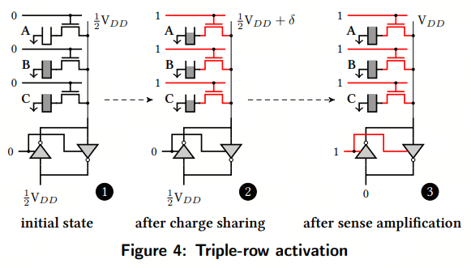

- **AND(A, B) = MAJ(A, B, 0)**
- **OR(A, B) = MAJ(A, B, 1)**
- **NOT**: Implemented via an inverter next to the SA

### 10.2 From Majority to Arbitrary Logic: MIG

**Majority-Inverter Graph (MIG)** is a logic expression model using only two primitive gates: MAJ + INV. It can be proven that any Boolean function can be expressed using MIG. MIG and **AIG (And-Inverter Graph)** are two parallel logic expression models — based on these two models, any Boolean function can be expressed.

Mapping MIG onto DRAM yields a computational structure that **requires no external ALU/FPU or any other compute cores** — all operations are completed within the cell array through charge sharing, with the bitline serving as the computation result, achieving the physical limits of energy consumption and bandwidth.

To implement PUM within a Mat, two rows are typically reserved as auxiliary rows: one row with all capacitors at 0 voltage, and one row with all capacitors at 1 voltage, to serve as auxiliary rows in TRA.

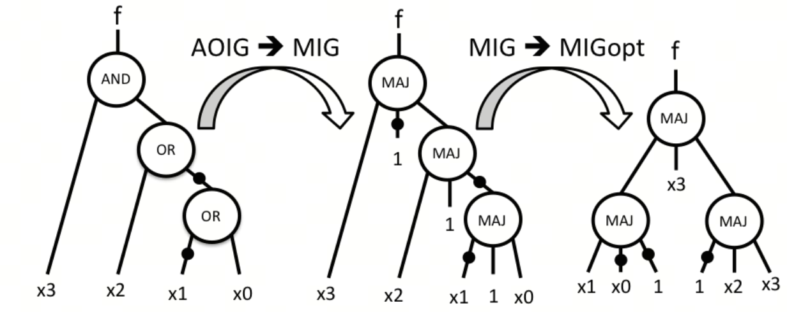

### 10.3 PUM Capabilities

- **RowClone**: Directly copy one row to another through the SA, saving the cache line movement;
- **In-DRAM bitwise**: AND / OR / NOT implemented through SA and row activation;
- **SIMD pipeline**: Different Mats can listen to the same instruction and simultaneously perform TRA on different local data;
- **ComputeDRAM / SIMDRAM**: PUM abstraction frameworks on commodity DRAM.

### 10.4 Limitations

- **Precision issues**: Natively supports only bitwise operations; performing INT8/FP16 requires bit-serial emulation, causing latency to explode. For example, suppose we want to perform an AND operation where one capacitor voltage is 0 and the other two capacitor voltages are 0.6 (rather than full voltage of 1) — the final voltage would still be below Vdd/2. Therefore, PUM is extremely sensitive to refresh frequency, requiring capacitor charge to always remain in an active state to support computation accuracy.

- **Does not support dynamic precision**: PUM's float precision can only support predefined precision and cannot be dynamically adjusted.

- **Very sensitive to DRAM cell voltage margins and refresh timing**, making volume production difficult.

- Currently remains primarily at the academic research stage.

---

## 11. Current Progress: From Papers to Tape-out

### 11.1 Commercial Products and Tape-outs

- **UPMEM PIM-DIMM** (released 2019 / volume production Q1 2020): The industry's first commercial PIM product. Each DDR4 DIMM integrates 128 DPUs (8 chips × 16 banks/chip).

- **Samsung Aquabolt-XL HBM2-PIM** (ISSCC 2021 tape-out): The industry's first HBM-PIM tape-out, one PCU per bank, supporting FP16 MAC.

- **SK Hynix GDDR6-AiM** (ISSCC 2022 paper / 2023 AiMX accelerator card): GDDR6-based PIM, one PE per bank, optimized for LLM GEMV.

- **Samsung CXL-PNM** (announced 2022.10 Memory Tech Day): Exposing PIM/PNM capabilities under the CXL protocol, based on CXL disaggregated attached memory. Prototype 512 GB / 1.1 TB/s card, targeting recommendation systems and in-memory databases. Shows very promising gains for recommendation systems with heavy embedding retrieval demands and in-memory database scenarios.

### 11.2 Key Academic Works

**CENT / PIM is All You Need (ASPLOS 2025)**

A PIM system specifically designed for large model Transformer architecture inference, representing a very solid academic advancement. CENT = **CXL-ENabled GPU-Free sysTem**, using CXL-PIM entirely for LLM inference, **completely eliminating the GPU** — it can operate entirely without relying on central processors like GPUs for any computation, using the central processor only as a scheduling core and placing all actual computation on PIM devices. Furthermore, the CENT architecture is implemented based on CXL expansion memory.

CENT maps all operators in the Transformer architecture onto PIM devices, including various attention, activation function, FFN, and LayerNorm operators in the prefill/decode stages, with various pipeline-dimension and tensor-dimension parallel partitioning.

Experimental configuration (Llama2 three sizes, 4K context, vLLM batch=128 vs. CENT pipeline parallel):

| **Model** | **GPU baseline** | **CENT** |
| --- | --- | --- |
| Llama2-7B | 1× A100 80GB | 8 CXL-PIM devices |
| Llama2-13B | 2× A100 80GB | 20 CXL-PIM devices |
| Llama2-70B | 4× A100 80GB | 32 CXL-PIM devices |

Each CXL-PIM device contains 32 GDDR6-PIM channels (approximately AiMX scale). The comparison is based on **similar average power consumption** (not equal device count) — CENT uses far more PIM devices than GPUs, but individual devices are cheap and low-power.

**Results (three-model geomean)**: ~2.3× throughput, ~2.9× more energy efficient, 5.2× tokens/dollar TCO.

- The 70B model shows only 1.2× — because GQA significantly increases the operational intensity of attention, eating into PIM's memory-bound advantage. On 7B/13B where attention is standard MHA, the speedup is notably higher (estimated 3–4×).

- Mainstream large models have almost all adopted GQA/MQA → throughput advantage will shrink, **but TCO advantage remains relatively robust** (GDDR6's cost per unit of bandwidth is far lower than HBM).

**Other academic works**:

- **ReCXL (ISCA 2024)**: Places NDP logic into the CXL controller, targeting the embedding access patterns of recommendation model training for prefetching and reduce.

- **SpecPIM (ASPLOS 2024)**: Focuses on deploying speculative decoding on PIM systems. The core observation is that the draft model (small) and target model (large) have fundamentally different resource demand patterns, and traditional fixed mapping cannot optimize for both. SpecPIM is an **architecture-dataflow co-exploration framework** that simultaneously explores the design space of hardware architecture and dataflow mapping, finding the optimal configuration for each draft+target combination.

---

## 12. Summary

Returning to the Memory Wall at the beginning.

**Core viewpoint one**: As the era of super-large models continues to expand memory parameter sizes, **CXL disaggregated attached memory devices** have become an effective solution for addressing storage capacity limitations (the viewpoint from the previous tech share). CXL redefines the boundaries of the memory subsystem — memory can be decoupled, pooled, and given protocols.

**Core viewpoint two**: **Processing-in-memory** has already achieved many solid results and has been validated to effectively solve the memory wall problem across multiple workload patterns including large model inference. Commercial PIM devices are continuously being deployed — UPMEM, HBM-PIM, GDDR6-AiM, CXL-PNM. Especially driven by LLM inference as a killer app, PIM is transitioning from "academic long-term" to "engineering near-term".

**Remaining challenges**:

- **Traditional DRAM continues to evolve** — DDR5, HBM3E, GDDR7 are all pushing bandwidth improvements through the limits of process technology and packaging;

- **The software stack remains one of the main blockers to large-scale PIM deployment** — programming models, data layout, and operator scheduling co-design still have a long way to go;

---

## References

### Foundational Works

- **[Kautz 1969]** W. H. Kautz, "Cellular Logic-in-Memory Arrays," *IEEE Transactions on Computers*, vol. C-18, no. 8, pp. 719–727, Aug. 1969. — *First proposed the idea of placing computation directly within memory storage units.*

- **[Stone 1970]** H. S. Stone, "A Logic-in-Memory Computer," *IEEE Transactions on Computers*, vol. C-19, no. 1, pp. 73–78, Jan. 1970.

### Onur Mutlu / SAFARI Classic Papers

- **[Mutlu+ 2025]** O. Mutlu, S. Ghose, J. Gómez-Luna, R. Ausavarungnirun, M. Sadrosadati, G. F. Oliveira, "A Modern Primer on Processing in Memory," *Emerging Computing: From Devices to Systems*, Springer, 2022; arXiv:2012.03112v5, Feb. 2025. — *The most comprehensive survey in the PIM field, covering PNM / PIM / PUM across the full stack.*

- **[Mutlu+ 2019]** O. Mutlu, S. Ghose, J. Gómez-Luna, R. Ausavarungnirun, "Processing Data Where It Makes Sense: Enabling In-Memory Computation," *Microprocessors and Microsystems*, vol. 67, pp. 28–41, Jun. 2019; arXiv:1903.03988. — *A systematic exposition of the "data-centric" design philosophy.*

- **[Kim+ 2014]** Y. Kim, R. Daly, J. Kim, C. Fallin, J. H. Lee, D. Lee, C. Wilkerson, K. Lai, O. Mutlu, "Flipping Bits in Memory Without Accessing Them: An Experimental Study of DRAM Disturbance Errors," in *Proc. ISCA*, pp. 361–372, Jun. 2014. — *The original RowHammer paper, first revealing system security vulnerabilities caused by DRAM circuit-level failures.*

- **[Mutlu & Kim 2019]** O. Mutlu, J. S. Kim, "RowHammer: A Retrospective," *IEEE TCAD*, vol. 39, no. 8, pp. 1555–1571, Aug. 2020; arXiv:1904.09724. — *RowHammer retrospective paper, systematically reviewing the evolution of the problem and defense directions.*

- **[Seshadri+ 2013]** V. Seshadri, Y. Kim, C. Fallin, D. Lee, R. Ausavarungnirun, G. Pekhimenko, Y. Luo, O. Mutlu, P. B. Gibbons, M. A. Kozuch, T. C. Mowry, "RowClone: Fast and Energy-Efficient In-DRAM Bulk Data Copy and Initialization," in *Proc. MICRO*, pp. 185–197, Dec. 2013. — *Using SA to directly complete inter-row copying within DRAM, bypassing the bus.*

- **[Seshadri+ 2017]** V. Seshadri, D. Lee, T. Mullins, H. Hassan, A. Boroumand, J. Kim, M. A. Kozuch, O. Mutlu, P. B. Gibbons, T. C. Mowry, "Ambit: In-Memory Accelerator for Bulk Bitwise Operations Using Commodity DRAM Technology," in *Proc. MICRO*, pp. 273–287, Oct. 2017. — *Triple Row Activation (TRA) implementing in-DRAM bitwise AND/OR, a milestone in the PUM direction.*

- **[Hajinazar+ 2021]** N. Hajinazar, G. F. Oliveira, S. Gregorio, J. D. Ferreira, N. M. Ghiasi, M. Patel, M. Alser, S. Ghose, J. Gómez-Luna, O. Mutlu, "SIMDRAM: A Framework for Bit-Serial SIMD Processing Using DRAM," in *Proc. ASPLOS*, pp. 329–345, Apr. 2021. — *A generalized PUM framework mapping arbitrary Boolean operations onto DRAM arrays.*

- **[Kim+ 2012]** Y. Kim, V. Seshadri, D. Lee, J. Liu, O. Mutlu, "A Case for Exploiting Subarray-Level Parallelism (SALP) in DRAM," in *Proc. ISCA*, pp. 368–379, Jun. 2012. — *Proposed subarray-level parallelism, an important foundation for subsequent PIM work.*

- **[Gómez-Luna+ 2022]** J. Gómez-Luna, I. El Hajj, I. Fernandez, C. Giannoula, G. F. Oliveira, O. Mutlu, "Benchmarking a New Paradigm: Experimental Analysis of a Real Processing-in-Memory Architecture," *IEEE Access*, vol. 10, pp. 52565–52608, 2022. — *The first systematic benchmark study on real UPMEM PIM hardware.*

### Commercial PIM and Systems

- **[Gu+ 2025]** Y. Gu\*, A. Khadem\*, S. Umesh, N. Liang, X. Servot, O. Mutlu, R. Iyer, R. Das, "PIM Is All You Need: A CXL-Enabled GPU-Free System for Large Language Model Inference," in *Proc. ASPLOS*, Mar. 2025; arXiv:2502.07578. — *CENT architecture: completely eliminating GPU, using CXL-PIM devices for full LLM inference.*

- **[Lee+ 2021]** S. Lee et al., "A 1ynm 1.25V 8Gb, 16Gb/s/pin GDDR6-based Accelerator-in-Memory supporting 1TFLOPS MAC Operation and Various Activation Functions," *ISSCC*, Feb. 2022. *(SK Hynix GDDR6-AiM)*

- **[Kwon+ 2021]** Y. Kwon et al., "25.4 A 20nm 6GB Function-In-Memory DRAM, Based on HBM2E with a 1.2TFLOPS Programmable Computing Unit Using Bank-Level Parallelism, for Machine Learning Applications," *ISSCC*, Feb. 2021. *(Samsung Aquabolt-XL HBM2-PIM)*

### CXL and Near-Memory Computing

- **[Liu+ 2024]** H. Liu, L. Zheng, Y. Huang, J. Zhou, C. Liu, R. Wang, X. Liao, H. Jin, J. Xue, "Enabling Efficient Large Recommendation Model Training with Near CXL Memory Processing (ReCXL)," in *Proc. ISCA*, pp. 382–395, Jun. 2024. — *CXL controller-level NDP, embedding training completed entirely within CXL memory.*

### Speculative Decoding on PIM

- **[Li+ 2024]** C. Li, Z. Zhou, S. Zheng, J. Zhang, Y. Liang, G. Sun, "SpecPIM: Accelerating Speculative Inference on PIM-Enabled System via Architecture-Dataflow Co-Exploration," in *Proc. ASPLOS*, pp. 950–965, Apr. 2024. — *Architecture-dataflow joint exploration framework, finding optimal PIM configurations for draft+target combinations.*

- **[Wang+ 2026]** R. Wang, Q. Wang, H. Liu, L. Zheng, X. Liao, H. Jin, J. Xue, "Adaptive Draft Sequence Length: Enhancing Speculative Decoding Throughput on PIM-Enabled Systems," in *Proc. HPCA*, pp. 1–15, 2026. — *Adaptive draft length optimization, addressing excessive token rejection under fixed draft length in large batch scenarios.*

### Classic Energy Consumption Data

- **[Horowitz 2014]** M. Horowitz, "1.1 Computing's Energy Problem (and what we can do about it)," *ISSCC Keynote*, Feb. 2014. — *Classic quantitative source for data movement vs. computation energy (640 pJ DRAM read vs. 3.7 pJ FP MUL).*